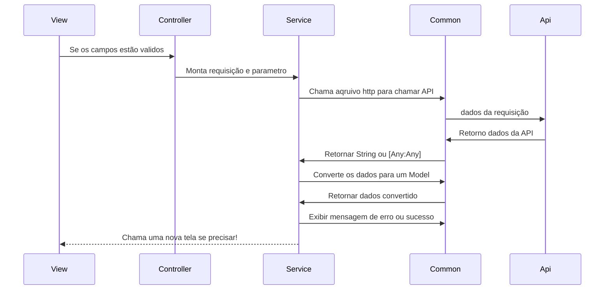

# Projeto My book!

Olá! Esse é o projeto feito para praticar e avaliar o conhecimento em **swift**.

Primeiro projeto mobile para IOS, um sistema de cadastro e edição de livros, a ideia é tentar fazer um sistema sozinho com o conhecimento básico em swift, podendo ser implementado:

 - Segurança (token).
- CRUD (Salvar, editar, deletar e editar um livro)
- Navegação entre telas.
- Design e responsividade.
- Testes unitários.

####  [API](https://github.com/inacioferrarini/BooksOnTheTableServer) usada na requisições

## Inicialização
 O projeto deve ser simulado no Iphone 11, pois o projeto não está responsivo 

## Etapas

- Layout.   :white_check_mark:
	> Criar uma replica do layout proposto no storyboard. (Nessa parte do desenvolvimento, não se preocupar com responsividade ou com dropdown).
	
- Common.   :white_check_mark:
	> Criar o arquivos genéricos que podem ser usados em todas as telas da aplicação, como criar Alerta, styles , constantes, entre outros.
	
- Chamada API - **POST** e **GET**.   :white_check_mark:
	> Criar a função genérica, para fazer um post e get na API. Optei por usar o [Alamofire](https://github.com/Alamofire/Alamofire) (A cada necessidade ir implementando outros métodos como o **PUT** ou **DELETE**). as requisições estavam sendo feitas, porém a resposta estava sendo exibida somente no console.
	
Depois de fazer o POST e GET tentei integrar as requisições com o sistema.

- Exibir mensagem de erro da API.   :white_check_mark:
	> Caso algum parâmetro não esteja valido para a API, a mesma retorna uma mensagem, fiz uma função para exibir a mensagem na tela em um Alert.
	
- Navegação entre telas.   :white_check_mark:
	> Usei NavigationController para fazer a navegação entre telas.
	
- Criação de usuário e Login.   :white_check_mark:
	> Incluindo a navegação entre telas, chamada a API, validações de campos e por fim exibir o token que retorna na API no console.
	
- Salvar token.   :white_check_mark:
	> Nessa parte do desenvolvimento a ideia era salvar o token em uma variável global, para ser usada nas novas requisições.

Como as telas estavam feitas, as rotas funcionando , tinha as duas funções principais de requisições (GET e POST) a ideia agora era trabalhar na função de cadastrar livros.
	
- Cadastro de livro.   :white_check_mark:
	> Validações dos campos,  montar requisição com token, e enviar a requisição pra API e exibir os livros no console.
	
- Exibir livros.   :white_check_mark:
	> Na tela principal a ideia era exibir os livros já cadastrados em uma collection view 
	
- Paginação dos livros.  :x:
	> Fazer a paginação dos livros na Home, até o momento ele exibe somente 3.
	
- Separar livros por categoria  :x:
	> Separar em: Lendo, para ler e lido.
	
	- Pesquisar livros  :x:
	> Não terminei por falta de tempo
	
- Ver detalhes do livro  :white_check_mark:
	> Ao clicar no livro ser direcionado para outra tela com os detalhes do livro.
	
- Editar livro  :white_check_mark:
	> Na tela de detalhes ter a opção de editar o livro
	> Fiz na mesma tela de cadastrar livro, só que com os campos carregados.
	>Para isso criei o  **PUT** pra chamar a API
	
Como as requisições sendo feita e todas as telas funcionando é hora de salvar dados locais para evitar chamar a API várias vezes.

- Salvar token local :x:
	> Feature não iniciada
	
- Salvar livros local :x:
	> Feature não iniciada
	
- Função para atualizar os livros local com a API :x:
	> Feature não iniciada
	
Como tudo funcionando é hora de cuidar da responsividade 

- Criação de constants em todas as telas para o layout se adaptar em tamanhos diferentes de dispositivos. :x:
	> Feature não iniciada
	
Testes 

- Escrita de testes unitários :x:
	> Feature não iniciada

	

# Padrão de projeto

Inicialmente pensei em usar **MVC**, porém com o cuidado para o **C**ontroller não ficar carregado de informações criei uma paste **Service**, responsável por montar e cuidar das requisições, deixando o Controller somente com o controle da view. Como validar e carregar os campos.

## UML diagrams
Obs: A camada **Common** é uma pasta com vários arquivos **útils** responsável por conversão,  personalização, alertas, entre outras funções gerais para o sistema 

# Dificuldades

A falta de um MAC físico foi um pequeno empecilho, já que usei Mac Stadium, nos primeiros dias o acesso pela [VNC](https://www.realvnc.com/pt/connect/download/viewer/) ficou muito lento, depois de uma nova forma de acesso os atalhos do teclado não funcionam.

Requisições Asyc, passeis dois dias para entender melhor como usar as requisições async.

Padrão de projeto, saber melhor como organizar as pastas do projeto para facilitar novas Features.
